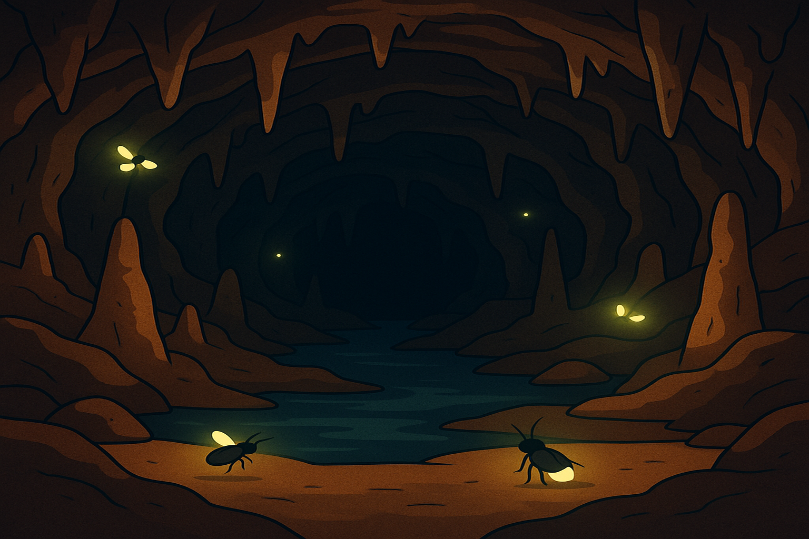
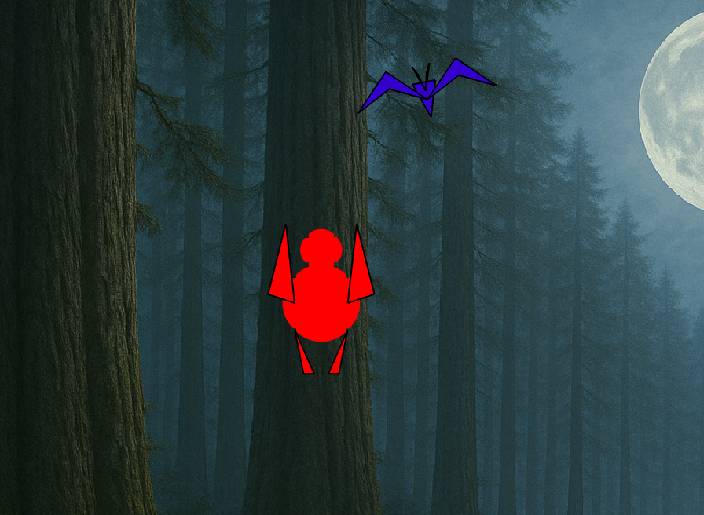
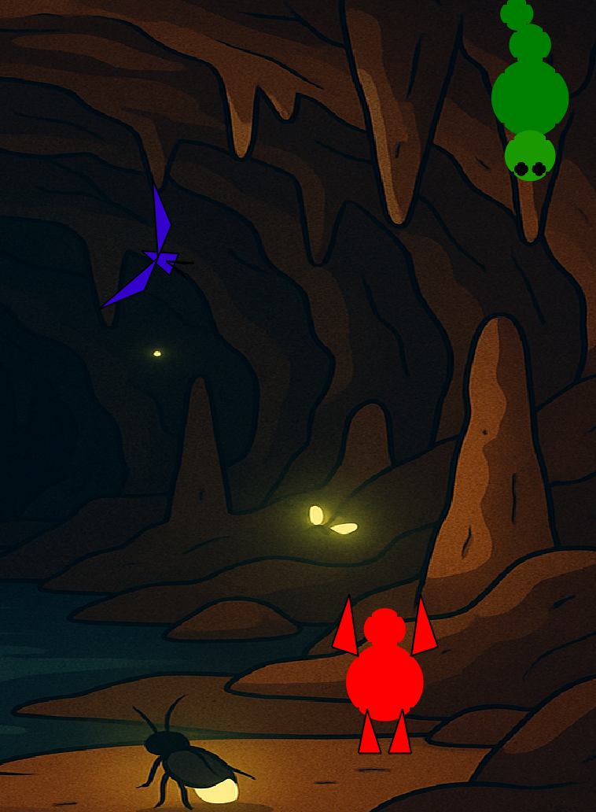
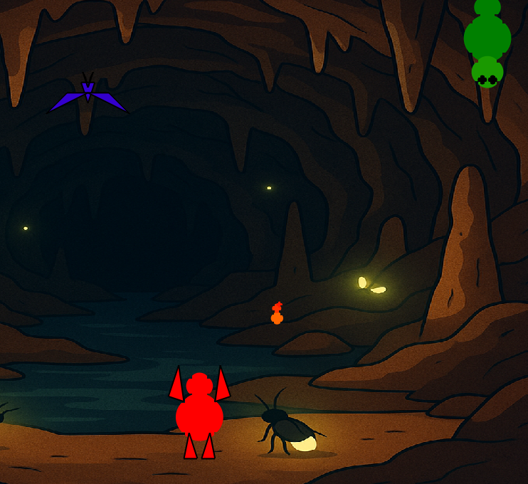

## BigFoot
###### A CS100 Project by Peter Nielsen

### About
BigFoot is a student project for CS100 @ Cal Poly Humboldt. This is my iteration of the BigFoot game. Licensed under [Creative Commons](./LICENSE).

Contact Info: [peternielsen112](https://github.com/peternielsen112) on GitHub; [pan25@humboldt.edu](mailto:pan25@humboldt.edu).

## Contents
* [About](#about)
* [Credits](#credits)
* [Requirements](#requirements)
* [To Run](#to-run)
* [To Play](#to-play)
* [To Win](#to-win)
* [Screenshots](#screenshots)
* [Known Issues](#known-issues)
* [Final Write Up](#final-write-up)

### Credits
The CS100 course was taught in Fall 2025 by **Dr. Ken Owens** at Cal Poly Humboldt. This included the code requirements which guided the projects. Dr. Owens is also responsible for the music files (`.wav`) and background files (`cave.png` and `spookyForest.png`) which came from given course materials. Additionally, the files [keyPress.m](./keyPress.m), [drawLine.m](./drawLine.m), and [drawBackground.m](./drawBackground.m) were taken directly from the course Canvas page per the project instructions; these files are not written by me, only utilized by me in the main [game.m](./game.m) code. [getRotate.m](./getRotate.m) and [getTranslate.m](./getTranslate.m) were developed collaboratively during a class session. All other work was completed by me.

### Requirements
This program runs (rather annoyingly) in **MatLab Octave** (file extension .m). To edit files, it is recommended you navigate to the program folder using `cd .../bigFoot` in your terminal, then running `octave --gui`. This assumes, of course, that you have not only installed Octave but added it to PATH.

### To Run
To run this program, either **run the Octave GUI** or run Octave from your command line, then run the command `game`.

### To Play
You play as **BigFoot**, a red polygonal character trying to catch **Batty**, a meddling bat in your home forest. You have the ability to **walk** back and forth, **climb** trees and other obstacles, and **jump**. You can jump to the side from the trees or jump up from the ground. (You can also rotate side to side, but this is rather ineffective.) Below are the keyboard controls:

| Control | Action |
| :------- | :------ |
| `A` | strafe **left** |
| `D` | strafe **right** |
| `W` | walk up/climb |
| `S` | walk down/descend |
| `X` | jump |
| `Q` | rotate **left** |
| `E` | rotate **right** |
| `K` | **quit game** |

But, even though BigFoot is a natural predator to Batty, "there's always a bigger fish" - in this case, **Catty**, a cave caterpillar who's unhappy to see you and shoots fireballs in your general direction. Be careful, because **these fireballs take a quarter of your health!** Catch the bat in the cave before you get too burnt.

### To Win
Catch Batty twice - once in the forest, once in the cave - and don't get too burnt along the way, and you'll be greeted with exciting fanfare and a win message.

### Screenshots!

###### fig. 1: woods background present in level one.

###### fig. 2: cave background present in level two.

###### fig. 3: the bat and BigFoot in the woods

###### fig. 4: the bat and BigFoot encounter a scary green... caterpillar?

###### fig. 5: the caterpillar's bringing the heat.

### Known Issues
As of release RELEASE NUMBER, the known issues are as follows.
- **Audioplayer bug:** if the device's sound output device changes while the Octave GUI is running, it has the potential to prevent the game from starting. **Workaround:** restart the Octave GUI.  
- **Warnings on Game Exit:** When quitting the game with `k` (and occasionally on the win/lose conditions), the Octave terminal will return a warning message about the music player. **Workaround:** This could probably be remedied by adding code towards the end of [game.m](./game.m) to stop all audio players before quitting the game.  

### Final Write Up
Altogether, this project presented a unique and irregular challenge: writing a working, engaging game in a programming language meant for displaying charts. Now, obviously this isn't impossible - have you *seen* what they're doing with Desmos these days? - but still not my preference. I'm much more comfortable creating a game in a language like Ruby or even C++, or something with easy libraries like Python (if you're interested, check [this](https://github.com/peternielsen112/hftgclassic) out). But, as I came to realize, that wasn't the point - to get me *out of my comfort zone*. And that it did!

I chose to work alone on this project so I could keep a better handle on how it progressed. I utilized [a GitHub repository](https://github.com/peternielsen112/bigfoot) to keep a solid grip on version control; I even ended up using a seperate branch at one point to develop fireballs. (If I were to continue developing this, however, I'd leave the `main` branch for the releases or create a `release` branch to make it more official.) There are over 20 commits, and I should have committed more often and in more detail, but they provide at least decent snapshots of my working process.

Creating the bat from scratch ([getBat.m](./getBat.m), [drawBat.m](./drawBat.m)) turned out okay, and using circles and triangles (easier to fill and move) for BigFoot helped too. Additionally, I reutilized the [drawFilledCircle.m](./drawFilledCircle.m) code I wrote for BigFoot to create Catty the Caterpillar. This class placed a heavy emphasis on critical thinking and working *smarter*, not *harder*, to create computer programs - therefore, optimizing program performance and minimizing extraneous/unnecessary code was a good goal in line with CS100 dogma. The drawFilledCircle code also came in handy to create the fireball.

Speaking of the fireball, if one thing in particular stands out about this project comparative to other iterations of the concept, it should be the fireball mechanics and drawing. I created [fireMotion.m](./fireMotion.m) with the goal to create fire projectiles that follow the player (BigFoot) around the screen, but only last for a few seconds; thus, the player can outrun the projectiles if they act fast. This turned out to be a bit of a pain, and required a little more math than I'd anticipated, but I'm happy with how it ended up. After all, you can't really have a game without obstacles, and Catty the Caterpillar's fireballs serve that purpose well.

Now, I'm sure you're thinking at this point: *caterpillar?* Well, I know it was supposed to be a dragon. Or, at least, recommended; but I decided that not only was one supernatural creature (BigFoot) quite enough for the project, but a three-circle caterpillar was much easier to deal with, if a little more abstract. The code pays an homage to the original idea, however; Catty is designed in a file called [drawDragon.m](./drawDragon.m).

This project better acquainted me with problem solving, critical thinking concepts, and of course the Matlab/Octave languages and syntax. Note that this project's code does not conform to established othodox Octave syntax. It should be noted, also, that this was not so much purposeful as much as I didn't care. The code in game.m at least seems nearly spaghetti; good luck reading it. I did my best to reformat, refactor, and document the project; however, you're bound to encounter redundancies and inefficiencies when building a project at the same time as learning the language. All in all, I had plenty of fun with the project; I'm hoping it's nearly as fun to grade as it was to mess around with.